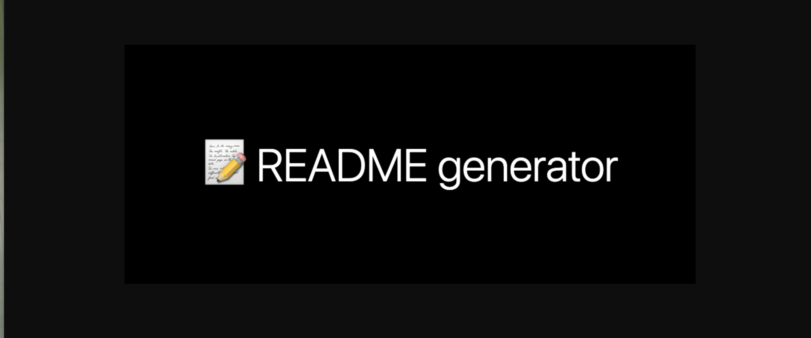

📘 READMEGENERATED

Description
📜📜
* This is a project will allow you to build a README file from a comman line.
📜📜

## 📋 Table of Contents
1️⃣. [Installation](#📑-installation)

2️⃣. [Usage](#-usage-infomation)

3️⃣. [Contributing](#📝-contributing-information)

4️⃣. [Tests](#💯-tests)

5️⃣.  [License](#💠-license)

6️⃣. [Questions](#❓-questions)

## 📑 Installation
Installations

## Usage infomation
Instructions

## 📝 Contributing
ThuLuong

## 💯 Tests
Test
[video](https://drive.google.com/drive/folders/1cNENryIo9B6HE685KIzq9l0pml6ryolw)

## 💠 License 

## ❓ Questions

For more informations about this project please contact me at:

* [Github](https://github.com/thuluong249)

* [Email](mailto: thujtn2019@gmail.com)
